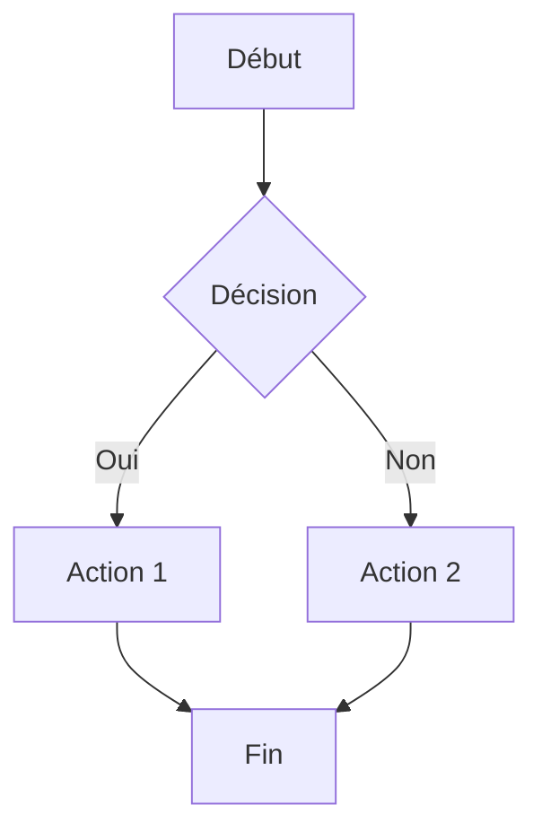
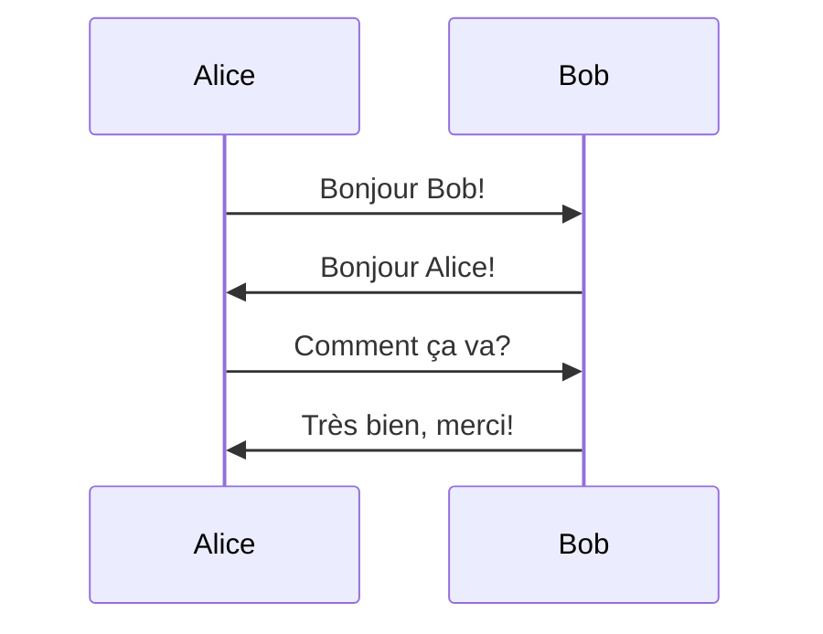
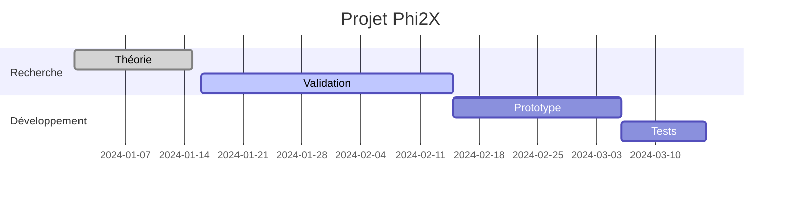
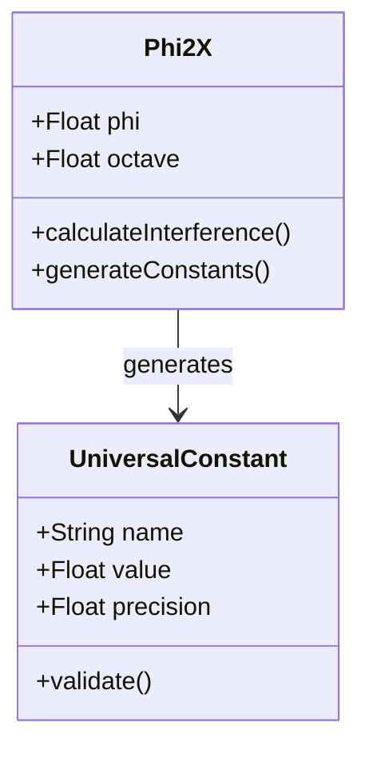

# Test Mermaid

Ce fichier teste l'intégration de Mermaid.js dans le système FRD.

## Diagramme de flux simple



## Diagramme de séquence



## Diagramme de Gantt



## Diagramme de classes



## Test avec erreur (syntaxe invalide)

```mermaid
graph TD
    A[Début
    B --> C
```

Fin du test Mermaid.
